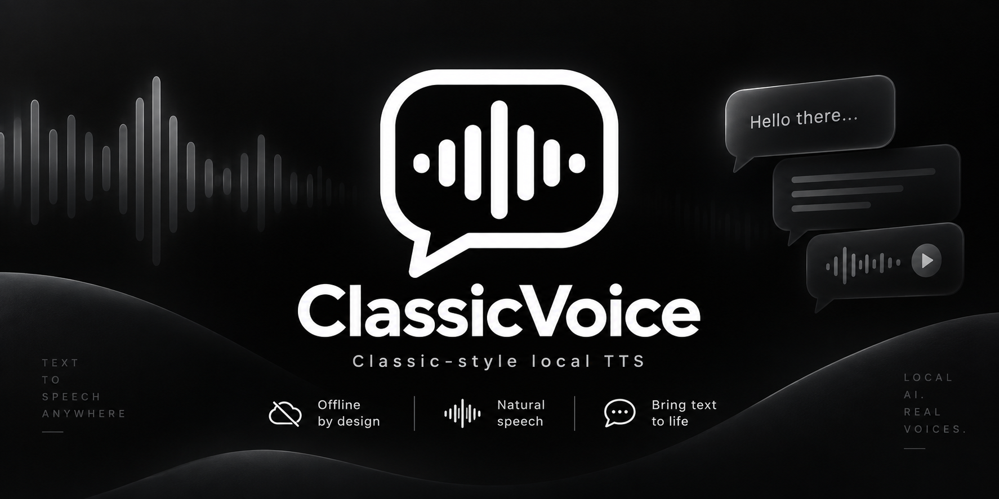

<p align="center">
  <br>
  <strong>ClassicVoice</strong>
</p>

<p align="center">
  <em>Write text. Tune the voice. Preview it. Export WAV.</em>
</p>

<p align="center">
  
</p>

ClassicVoice is a tiny local-first desktop utility for classic synthetic Spanish speech. It provides a clean UI over eSpeak NG with a small set of useful presets and direct control over speed, pitch and volume.

ClassicVoice is **not Loquendo**, does not include proprietary Loquendo voices and does not attempt to redistribute them.

## Features

- Text-to-speech entirely on the local machine
- Four Spanish-oriented starter presets
- Speed, pitch and volume controls
- Instant WAV preview
- WAV export
- No accounts, APIs, cloud services or telemetry
- Standard-library-only Python UI

## Requirements

- Windows 10/11
- Python 3.11+
- eSpeak NG installed on `PATH`, or a compatible local installation made available under `bin/`

> eSpeak NG distributions often require more than a single executable (voice data and DLLs). Keep the complete compatible distribution together when bundling it.

## Run

```powershell
python -m pip install -e .
python -m classicvoice
```

## Product scope

The v0.1 contract is intentionally narrow:

`Write → Choose/tune voice → Preview → Save WAV`

No timeline, AI model downloads, cloud synthesis, characters, project database or audio workstation features are part of v0.1.

## Privacy

ClassicVoice performs synthesis locally and makes no network requests.

## License

ClassicVoice source code is MIT licensed. eSpeak NG is a separate GPL-licensed project and is not redistributed by this repository. See [THIRD_PARTY.md](THIRD_PARTY.md).
